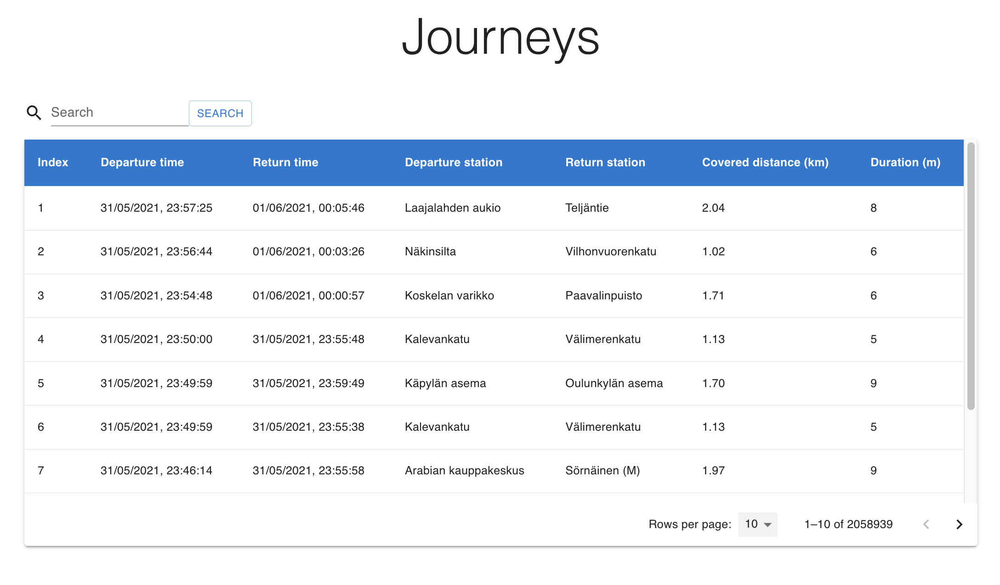
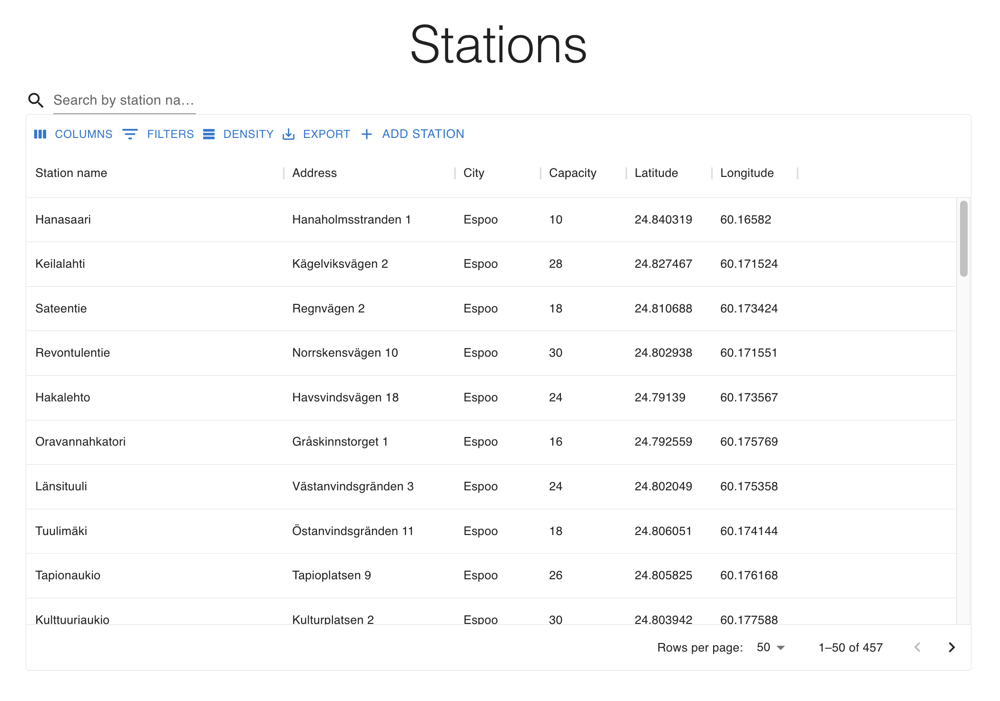

# Solita Dev Academy pre-assignment

Application for displaying data from journeys made with city bikes in the Helsinki Capital area.

- View Demo: [https://citybike.fly.dev/](https://citybike.fly.dev/)

## Project Description

This application was created as my solution to [Solita Dev Academy Pre-assignment](https://github.com/solita/dev-academy-2022-fall-exercise/tree/144fe777cdd4830dfa706a0d1dcb117b3ba5ea09).

## Tech Stack

<hr />
Since there are no limits to which technologies to use, I have decided to go with MERN stack since I'm mostly familiar with and have really enjoyed working with JavaScript.

### Database

During the time of studies in Business College Helsinki, I was equipped with fundamentals of both relational databases (MariaDB, MySQL) and non-relational database (MongoDB). But I've gained more hands-on experience by building several projects with MongoDB so for this particular project, I still choose MongoDB atlas as cloud database.

### Frontend: ReactJS

React is my first JavaScript framework that I have picked up and built several web projects with it.

- React
- axios
- Material UI

### Backend: NodeJS + Express

My first experience with backend development was with PHP when I was studying fullstack development program. But since I've found that NodeJS offers the chance to do more with JavaScript so I self-taught NodeJS and Express by doing personal projects and taking an online course by University of Helsinki. I have found it quite nice to work with since I always want to go for fullstack development. I'm also interested in Java and C#/.NET so I definitely want to extend my tech skills with these technologies in the future.

- nodejs
- express
- mongodb
- cors
- dotenv
- needle
- fastcsv
- csvtojson
- node-fetch

Additionally REST client and postman were used for testing API endpoints. As I want to get more familiar with testing, I configured cypress setup and wrote some simple tests. I wrote e2e tests before once when taking fullstack course by University of Helsinki.

## Installation

<hr />

- clone the repository (on 'main' branch)

- go to bikeApp-backend directory

  - install dependencies with

```shell
  npm install
```

Run with

```shell
npm start
```

Or in development mode with

```shell
npm run dev
```

- go to bikeApp-frontend directory
  - install dev dependencies by running
  ```shell
  npm install
  ```
  - start the app
  ```shell
  npm start
  ```

## App features

<hr />

### Home page

The homepage is fully responsive on different screen sizes with sticky navigation bar to navigate through different pages of the application.


### Data import

Data is fetch from provided links and inserted into cloud database hosted on MongoDB Atlas

As required:
journeys that lasted for less than 10 seconds are not imported
journeys that covered distances shorter than 10 meters

### Journey list view

#### Recommended

- List journeys: pagination table was implemented for listing journeys
- For each journey show departure and return stations, covered distance in kilometers and duration in minutes



#### Additional

- [x] Pagination
- [x] Searching is done from backend by sending request to /search route

### Station list

all stations are fetched and displayed (457 items in total)

- pagination
- searching is done from frontend, search query will be executed right away when search field is typed.



### Single Station view

When a row from the station table is clicked, single station and its data will be fetched and viewed. This might take a moment.
All recommended features are implemented:

- [x] Station name
- [x] Station address
- [x] Total number of journeys starting from the station
- [x] Total number of journeys ending at the station


some of the additional features are implemented:

- [x] Station location on the map
- [x] The average distance of a journey starting from the station
- [x] The average distance of a journey ending at the station
- [x] Top 5 most popular return stations for journeys starting from the station
- [x] Top 5 most popular departure stations for journeys ending at the station

### Running tests

Tests directory are located inside frontend root directory. Go to frontend directory

- Tests can be run from browser by running command:

```shell
npm run cypress:open
```

a window will be automatically open for you to choose which browser you wanna run the tests on. Choose a browser and run tests.

- OR they can be run from the command line with the command:
  and run command:
  ```shell
  npm run test:e2e
  ```

### Extra features implemented

- REST API endpoints for storing new journeys data and new bicycle stations were implemented.
- UI for adding bicycle stations were created. Unfortunately because of the limited database quota, these adding features and API endpoints could not be tested so the code blocks when the form is submitted is commented out for the time being.
- Some simple E2E tests were written for testing open different pages using navbar

## TODO

<hr />

- Journey list view: ordering per column, filtering
- filter all the calculations per month in single station view
- Running backend in Docker
- Running backend in Cloud

## Final thoughts

It was very exciting and challenging assignment. I spent quite a good amount of time, and I learned a lot by doing it. I highly recommend anyone giving this a try!

```

```

```

```
